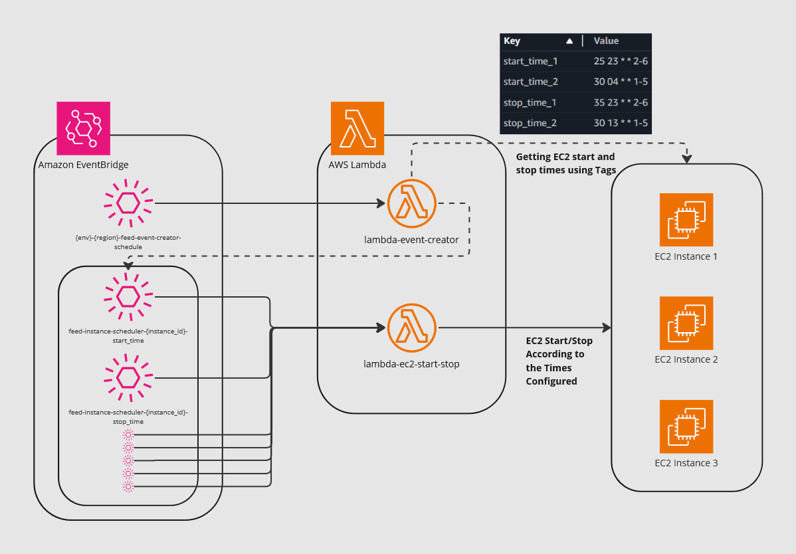

# Feed Instance Scheduler

## Overview

The Feed Instance Scheduler is a tool that uses AWS Lambda functions to manage EC2 instances based on scheduled events. It ensures efficient resource utilization by automating the starting and stopping of EC2 instances using AWS CloudWatch events.

---

## Key Features

- **Automated Scheduling**: Start and stop EC2 instances at specified times using tag-based scheduling.
- **Flexible Configuration**: Schedule instances with customizable cron expressions for granular control.
- **Logging**: Monitor actions and errors through integrated logging for better observability.
- **Scalability**: Supports multiple environments (DEV, UAT, PROD) with Terraform.

## Tagging EC2 Instances

The scheduling of EC2 instances is controlled using AWS tags. By applying specific tags to instances, you can define when they should start and stop.

### Required Tags

1. **`start_time`**: Specifies when the instance should start.
2. **`stop_time`**: Specifies when the instance should stop.
3. **`schedule_enabled`**: Used to enable or disable scheduling for the instance. Set to `true` to enable scheduling, or `false` to disable. (No need to add at the be)

### Tag Format

- Use the `cron` format
  ```
  cron(Minutes Hours Day-of-month Month Day-of-week Year)
  ```
  - **Minutes**: `0-59`
  - **Hours**: `0-23`
  - **Day-of-month**: `1-31`
  - **Month**: `1-12` or `JAN-DEC`
  - **Day-of-week**: `1-7` or `SUN-SAT`

### Examples of Tagging

1. **Start Instances Every Day at 3:00 AM**

   - Key: `start_time`
   - Value: `0 3 * * *`

2. **Stop Instances Every Day at 6:00 PM**

   - Key: `stop_time`
   - Value: `0 18 * * *`

3. **Start Instances Every Monday to Friday at 8:00 AM**

   - Key: `start_time_1`
   - Value: `0 8 * * 2-6`

4. **Stop Instances on Weekends at 10:00 PM**

   - Key: `stop_time_1`
   - Value: `0 22 * * 7,1`

5. **Decline all schedules**
   - Key: `schedule_enabled`
   - Value: `false`

### Applying Tags

1. Open the **AWS Management Console**.
2. Navigate to the **EC2 Dashboard**.
3. Select the instance you want to schedule.
4. Go to the **Tags** tab and click **Manage Tags**.
5. Add the following key-value pairs:
   - **Key**: `start_time`, **Value**: `<cron expression>`
   - **Key**: `stop_time`, **Value**: `<cron expression>`

### Notes:

- **Tag Consistency**: Ensure tag keys and values are correct, as the Lambda function depends on these tags.
- **Default Behavior**: Instances without tags will not be affected by the scheduler.
- **Multiple Schedules**: Use `start_time_1`, `stop_time_1`, etc., for additional schedules.
- **Schedule Enabled**: The `schedule_enabled` tag is automatically added by the **event-creator Lambda function**, so no manual addition is required. setting this as `false` can stop the schedules.

---

## Configuration Details

- **Terraform Files**:
  - `variables.tf`: Define reusable variables.
  - `<environment>.tfvars`: Environment-specific configurations.
  - `provider.tf`: Configure the AWS provider.
  - `lambda.tf`: Deploy the Lambda function.
  - `cloudwatch.tf`: Manage CloudWatch events.
  - `iam.tf`: Set up IAM roles and permissions.

---

## Logging and Monitoring

- **CloudWatch Logs**:
  - Monitor Lambda execution logs in the AWS CloudWatch console.
- **Error Tracking**:
  - Errors and exceptions are logged for troubleshooting.

## Instance Schduler Architecture


